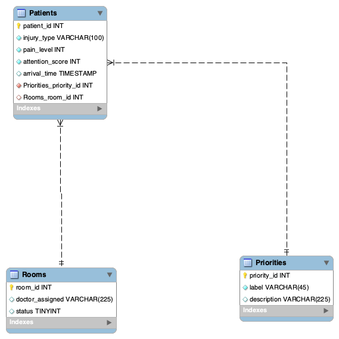

# Hospital Triage Web App — Database MD 
- written by Mahmoud Ahmed and Aayan Shaikh

# reference to the markdown 

- 

# written databse script with filled values 

- LAB 11 — HOSPITAL TRIAGE DATABASE
Clean Reset + Correct Schema + Commented Script

-- -----------------------------------------------------
-- 1️⃣ DROP OLD TABLES (to avoid PK / FK conflicts)
-- -----------------------------------------------------
-- Patients must be dropped first because it depends on Rooms & Priorities
-DROP TABLE IF EXISTS Patients;
- DROP TABLE IF EXISTS Rooms;
- -DROP TABLE IF EXISTS Priorities;

-- -----------------------------------------------------
-- 2️⃣ CREATE TABLE: PRIORITIES
-- -----------------------------------------------------
-- This table stores severity levels (Low, Moderate, High, Critical)
-- Each priority is referenced by many Patients
- CREATE TABLE IF NOT EXISTS Priorities (
- priority_id INT NOT NULL AUTO_INCREMENT,   -- Primary key
- label VARCHAR(45) NOT NULL,                -- Priority name
- description VARCHAR(225) NULL,             -- Optional explanation
- PRIMARY KEY (priority_id)
- ) ENGINE = InnoDB;

-- -----------------------------------------------------
-- 3️⃣ CREATE TABLE: ROOMS
-- -----------------------------------------------------
-- This table stores room information
-- A room can be assigned to many patients (over time)
- CREATE TABLE IF NOT EXISTS Rooms (
- room_id INT NOT NULL AUTO_INCREMENT,       -- Primary key
- doctor_assigned VARCHAR(225) NULL,         -- Optional assigned doctor
- status TINYINT NULL DEFAULT 0,             -- 0 = available, 1 = occupied
- PRIMARY KEY (room_id)
- ) ENGINE = InnoDB;

-- -----------------------------------------------------
-- 4️⃣ CREATE TABLE: PATIENTS
-- -----------------------------------------------------
-- Main triage table storing patient submissions
-- Contains foreign keys referencing PRIORITIES and ROOMS
- CREATE TABLE IF NOT EXISTS Patients (
- patient_id INT NOT NULL AUTO_INCREMENT,     -- Unique patient entry ID
- injury_type VARCHAR(100) NOT NULL,          -- Selected by the user
- pain_level INT NOT NULL,                    -- Value 1–5
- attention_score INT NOT NULL,               -- Used for sorting
- arrival_time TIMESTAMP NULL DEFAULT CURRENT_TIMESTAMP,  -- Auto timestamp

    -- Foreign key to PRIORITIES
 Priorities_priority_id INT NOT NULL,

- Foreign key to ROOMS, NULL because patients may not yet have rooms
- Rooms_room_id INT NULL,

- PRIMARY KEY (patient_id),                   -- Correct PK (ONLY patient_id)

- Indexes for foreign key performance
- INDEX fk_Patients_Priorities_idx (Priorities_priority_id ASC),
- INDEX fk_Patients_Rooms_idx (Rooms_room_id ASC),

- FK: Patient → Priority
- CONSTRAINT fk_Patients_Priorities
- FOREIGN KEY (Priorities_priority_id)
- REFERENCES Priorities (priority_id)
- ON DELETE NO ACTION
- oN UPDATE NO ACTION,

- FK: Patient → Room (nullable)
- CONSTRAINT fk_Patients_Rooms
- FOREIGN KEY (Rooms_room_id)
- REFERENCES Rooms (room_id)
- ON DELETE NO ACTION
- ON UPDATE NO ACTION
- ) ENGINE = InnoDB;

- 5️⃣ INSERT SAMPLE DATA INTO TABLES

-- -----------------------------------------------------
-- Insert Priority Levels
-- -----------------------------------------------------
- INSERT INTO Priorities (label, description) VALUES
- ('Low', 'Low urgency – minor injuries'),
- ('Moderate', 'Moderate urgency – attention needed soon'),
- ('High', 'High urgency – fast response required'),
- ('Critical', 'Critical condition – immediate action required');

-- -----------------------------------------------------
-- Insert Room Information
-- -----------------------------------------------------
- INSERT INTO Rooms (doctor_assigned, status) VALUES
- ('Dr. Ahmed', 1),    -- Room occupied
- ('Dr. Sara', 0),     -- Room free
- ('Dr. Khan', 1),     -- Room occupied
- ('Unassigned', 0);   -- Free / no doctor

-- -----------------------------------------------------
-- Insert Sample Patient Records
-- -----------------------------------------------------
-- Note: Some patients have NULL room_id because they are not assigned yet
- INSERT INTO Patients (
- injury_type, pain_level, attention_score,
- Priorities_priority_id, Rooms_room_id
- ) VALUES
- ('Burn', 3, 6, 2, 1),              -- Moderate priority, Room 1
- ('Broken Bone', 4, 8, 3, 2),       -- High priority, Room 2
- ('Cut / Wound', 1, 2, 1, NULL),    -- Low priority, No room assigned
- ('Head Injury', 5, 10, 4, 3),      -- Critical, Room 3
- ('Allergic Reaction', 2, 4, 2, NULL); -- Moderate, No room assigned
