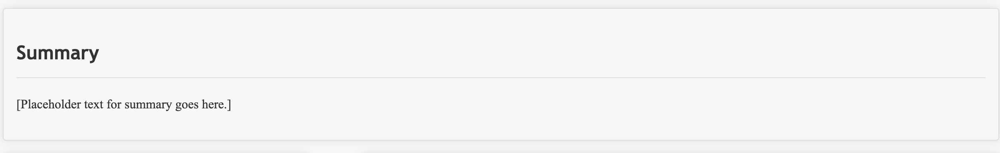

# Moody Tawfiq – Design System Documentation

This document outlines the design system used for *Resume Mock-up*. It covers the **color palette**, **typography**, **components**, and **layout structure**.

---

## 1. Color Palette
Consistent colors are applied throughout the design:

- **Primary Color (Links, Highlights):** `#007BFF`
- **Text Color (Body):** `#333`
- **Header Title Color:** `#444`
- **Border Color:** `#ddd`
- **Background Color (Page):** `#f7f7f7`
- **Surface Background (Sections, Cards):** `#fff`
- **Navigation Background:** `#333`
- **Navigation Hover:** `#555`

---

## 2. Typography
Fonts ensure readability and hierarchy across the resume.

- **Body Text:** `"Times New Roman", Times, serif`
- **Headers (h1, h2, h3):** `'Trebuchet MS', sans-serif`

---

## 3. Components and Layout

### Header
- **Design:** Centered text with subtle grey background and bottom border.
- **Content:** Name, address, phone, email.

---

### Navigation
- **Design:** Dark grey background (`#333`) with white text links.
- **Hover State:** Darkens to `#555`.
- **Layout:** Horizontal list, centered using flexbox.

---

### Summary Section
- **Design:** White card background with padding and shadow.
- **Content:** Short professional overview.

---

### Education & Skills (Content Grid)
- **Design:** Two-column grid layout.
    - **Left (Aside):** Education list.
    - **Right (Article):** Skills list.
- **Responsive:** Stacks vertically on smaller screens.

---

### Work Experience
- **Design:** Card-style layout with job titles, company, dates, and descriptions.
- **Text:** Dates are italicized for emphasis.

---

### Footer
- **Design:** Light grey background with centered text.
- **Purpose:** Closing statement or references note.

---

## 4. Layout Rules
- **Grid/Flexbox:**
    - Content area uses CSS grid (`1fr 2fr`) for education + skills.
    - Navigation uses flexbox for alignment.
- **Spacing:**
    - Consistent padding inside sections (1em).
    - Margins around containers (2vh 2vw).
- **Responsiveness:**
    - Grid becomes stacked on smaller screens.
- **Box Styling:**
    - Rounded corners (`5px`) and subtle shadows for sections/cards.

---

## 5. Conclusion
This design system documents the **colors, fonts, layouts, and components** of Moody’s Resume project. Adding screenshots to each section will complete the documentation and make the design easy to review on GitHub.

