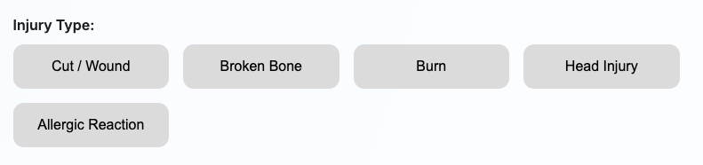
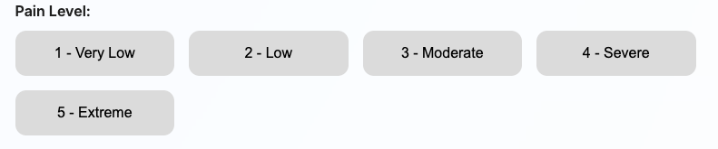
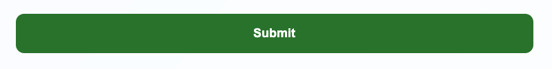
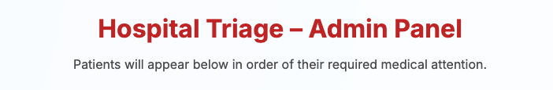
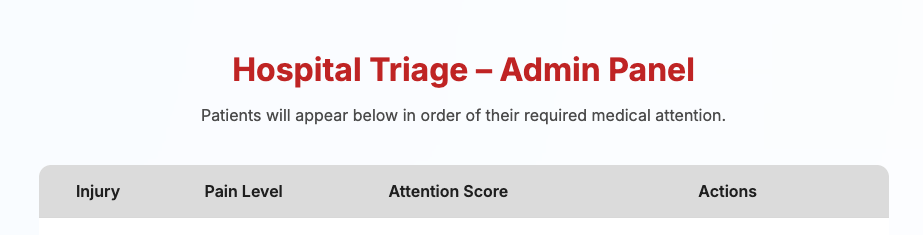
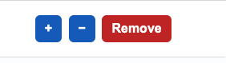

# 🏥 Hospital Triage Web App — Design System
**Lab 10 — CST3106**  
**Prepared By:** Mahmoud Ahmed and Aayan Shaikh

---

# 1️⃣ Typography (Both Pages)

**Font Used:** Inter (Google Fonts)  
**Weights:**
- 400 — body text
- 600 — section titles
- 700 — main titles

This font was chosen for its readability and clean medical UI appearance.

---

# 2️⃣ Colour Palette (Both Pages)

| Element | Color | Hex |
|---------|--------|---------|
| Background Glow | Light Medical Blue | `#BBDEFB` |
| App Card / Container | Semi-Transparent White | `#FFFFFF` |
| Titles | Medical Red | `#C62828` |
| Submit Button | Medical Green | `#2E7D32` |
| Selection Buttons | Grey | `#E0E0E0` |

The palette creates a clean, calm medical interface.

---

# 3️⃣ USER PAGE DESIGN 

This page collects triage information from the patient.

---
## 3.1 Main Container
- Centered card-style layout
- Rounded corners
- Soft shadow
- Semi-transparent white background
- Enough padding to keep elements readable

 

---

## 3.2 Injury Type Section
- Title “Injury Type”
- 5 grey rounded buttons
- Hover and selected (blue) states
- Responsive grid layout

 

---

## 3.3 Pain Level Section
- Same grid layout as Injury
- 5 pain level buttons (1–5)
- Selected button becomes highlighted

---

## 3.4 Submit Button
- Large full-width green button
- Hover effect
- Saves data into `localStorage`
- Redirects to Admin page

---

# 4️⃣ ADMIN PAGE DESIGN 

This page simulates a triage dashboard for hospital staff.

---
## 4.1 Admin Container
- Same style as User container
- Slightly wider for table
- Title + description

---
## 4.2 Patient Table
Columns:
- Injury
- Pain Level
- Attention Score
- Actions (+ / – / Remove)

Design:
- Grey header bar
- White table rows
- Thin borders
- Centered text

---

## 4.3 Admin Action Buttons
- **Increase (+)** — Blue
- **Decrease (–)** — Blue
- **Remove** — Red

All buttons:
- Rounded
- Hover states
- Consistent sizing

---

# 5️⃣ Layout Structure (Both Pages)

## User Page Flow
1. Title
2. Description
3. Injury Type selection
4. Pain Level selection
5. Submit Button

## Admin Page Flow
1. Title
2. Description
3. Patient table
4. Action buttons

---

# 6️⃣ Consistency

Consistency is maintained through:
- Same font family
- Same border-radius
- Shared color scheme
- Matching grid layout
- Same spacing + shadow rules
- Same container style

---

# 7️⃣ Layout, Wireframes & Navigation
1. User opens the User page.

2. User selects:
    - exactly one Injury Type
    - exactly one Pain Level (1–5)

3. When the user clicks "Submit":
    - The app creates a new triage entry:
      injury = chosen injury type
      painLevel = chosen pain level
      attentionScore = initial score based on painLevel
    - The entry is stored (later labs: in the emergency_waitlist database).
    - The user sees a confirmation message; they stay on the same page.

4. When the Admin opens the Admin page:
    - The app loads all stored triage entries.
    - Entries are sorted by attentionScore (highest first).

5. For each row in the Admin table:
    - [+] increases the attentionScore (up to a max, e.g. 10).
    - [-] decreases the attentionScore (down to a min, e.g. 1).
    - [Remove] deletes the entry from the triage list.

6. After any admin action:
    - The table is updated (and re-sorted) to keep the most urgent cases at the top.

    

# 8️⃣ ER DIAGRAM

